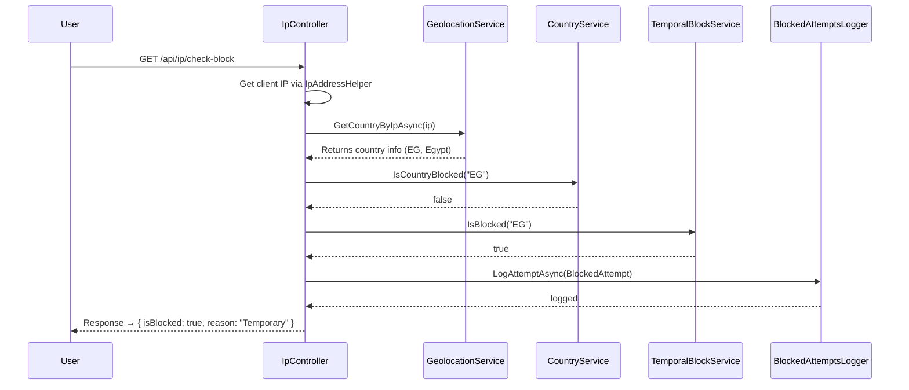

## 🧱 **BlockedCountries.API**

> A clean architecture .NET 9 Web API that manages **country blocking**, **IP-based restriction**, and **geolocation lookup** with **in-memory storage** and **background cleanup service**.

##### 🧅 Onion Architecture Version
[🔗 View Onion Architecture Branch](https://github.com/OmarAraby/Blocked-Countries/tree/onion-arch)

---

### 🚀 **Overview**

The **BlockedCountries API** allows system administrators to:

- Block or unblock countries permanently or temporarily
    
- Automatically remove expired temporary blocks
    
- Detect caller country via IP lookup (using `ipapi.co` or `ipgeolocation.io`)
    
- Check if an incoming IP is blocked
    
- Log and view blocked access attempts with pagination
    

All data is stored **in-memory (thread-safe)** for simplicity — no database required.

---

### 🧩 **Tech Stack**

| Component           | Technology                                    |
| ------------------- | --------------------------------------------- |
| **Framework**       | ASP.NET Core 9 (C#)                           |
| **Architecture**    | Clean Architecture                            |
| **Storage**         | In-Memory Repositories (ConcurrentDictionary) |
| **HTTP Client**     | `HttpClient`                                  |
| **Background Jobs** | `IHostedService` / `BackgroundService`        |
| **Documentation**   | Swagger / Scalar UI                           |
| **Logging**         | Microsoft.Extensions.Logging                  |

---

### 📂 **Project Structure**

```
BlockedCountries.API/
│
├── Controllers/
│   ├── CountriesController.cs      # Block / Unblock / List countries
│   ├── IpController.cs             # IP lookup & block check
│   └── LogsController.cs           # Logs retrieval (paginated)
│
├── Services/
│   ├── Interfaces/
│   │   ├── ICountryService.cs
│   │   ├── IGeolocationService.cs
│   │   ├── IBlockedAttemptsLogger.cs
│   │   └── ITemporalBlockService.cs
│   │
│   └── Implementations/
│       ├── CountryService.cs
│       ├── GeolocationService.cs
│       ├── TemporalBlockService.cs
│       └── BlockedAttemptsLogger.cs
│
├── Repositories/
│   ├── Interfaces/
│   │   ├── IBlockedCountriesRepository.cs
│   │   ├── ITemporalBlocksRepository.cs
│   │   └── IBlockedAttemptsLogRepository.cs
│   │
│   └── InMemory/
│       ├── BlockedCountriesRepository.cs
│       ├── TemporalBlocksRepository.cs
│       └── BlockedAttemptsLogRepository.cs
│
├── Domain/
│   ├── BlockedCountry.cs
│   ├── TemporalBlock.cs
│   └── BlockedAttempt.cs
│
├── DTOs/
│   ├── Requests/
│   │   ├── BlockCountryRequestDto.cs
│   │   └── TemporalBlockRequestDto.cs
│   │
│   ├── Responses/
│   │   ├── BlockedAttemptDto.cs
│   │   ├── GeolocationResponseDto.cs
│   │   └── IpCheckResult.cs
│
├── BackgroundServices/
│   └── TemporalBlockCleanupService.cs   # Runs every 5 minutes
│
├── Helpers/
│   ├── IpAddressHelper.cs
│   ├── Pagination/
│   │   └── PageList.cs
│   └── GeneralResult/
│       └── ApiResponse.cs
│
├── appsettings.json
├── Program.cs
└── README.md
```

---

### ⚙️ **Setup & Run**

#### 1️⃣ Prerequisites

- .NET 9 SDK
    
- Internet connection (for Geolocation API)
    

#### 2️⃣ Clone the project

```bash
git clone https://github.com/yourusername/BlockedCountries.API.git
cd BlockedCountries.API
```

#### 3️⃣ Restore dependencies

```bash
dotnet restore
```

#### 4️⃣ Run the API

```bash
dotnet run
```

#### 5️⃣ Access Swagger

Open your browser:  
👉 `https://localhost:7235/swagger`  
or  
👉 `https://localhost:7235/scalar`

---

### 🌍 **Endpoints Summary**

#### 🧱 Countries

|Method|Endpoint|Description|
|---|---|---|
|`POST`|`/api/countries/block`|Permanently block a country|
|`DELETE`|`/api/countries/block/{countryCode}`|Unblock a country|
|`POST`|`/api/countries/temporal-block`|Temporarily block a country (auto expires)|
|`GET`|`/api/countries`|List blocked countries (paged, filtered)|

#### 🌐 IP Services

|Method|Endpoint|Description|
|---|---|---|
|`GET`|`/api/ip/lookup?ipAddress={ip}`|Get geolocation info by IP|
|`GET`|`/api/ip/check-block`|Check if the caller IP’s country is blocked|

#### 🧾 Logs

|Method|Endpoint|Description|
|---|---|---|
|`GET`|`/api/logs/blocked-attempts?page=1&pageSize=10`|Paginated blocked attempts log|

---

### ⏱ **Background Service**

A background worker (`TemporalBlockCleanupService`) runs every 5 minutes to:

- Detect expired temporary blocks
    
- Remove them from the in-memory store automatically
    

Logs appear in the console:

```
🧹 Cleaning up expired temporal blocks at 2025-10-21T22:05:00Z
✅ Expired temporal blocks cleaned up.
```

---

### 🌐 **Geolocation Service**

Uses the third-party API:

```
https://ipgeolocation.io/ipgeo?apiKey=YOUR_KEY&ip={ip}
```

Or fallback to `https://ipapi.co/{ip}/json/` if configured without an API key.

Automatically validates:

- IP format
    
- Private vs public IP
    
- API rate limits

### 🧩 **Mermaid Sequence Diagram**

flow  `/api/ip/check-block` 


---

### 📜 **Sample Responses**

#### ✅ Block Country

```json
{
  "success": true,
  "message": "Country blocked successfully"
}
```

#### 🌍 IP Lookup

```json
{
  "success": true,
  "data": {
    "ip": "156.202.7.173",
    "countryCode": "EG",
    "countryName": "Egypt",
    "city": "Cairo",
    "region": "Cairo"
  }
}
```

#### 🚫 Check Block

```json
{
  "success": true,
  "data": {
    "ip": "156.202.7.173",
    "countryCode": "EG",
    "countryName": "Egypt",
    "isBlocked": true,
    "blockedReason": "Temporary"
  }
}
```

---

### 🧪 **Testing Notes**

- You can test from Scalar UI
    
- Use **public IPs** (not 127.0.0.1) for lookup
    
- All APIs return `ApiResponse<T>` for consistent format
    

---

### 🧠 **Design Highlights**

- Clean separation of concerns
    
- Repository pattern with interfaces
    
- In-memory data access (no DB needed)
    
- Thread-safe operations (`ConcurrentDictionary`)
    
- Background service for temporal cleanup
    
- Typed results (`Results<Ok<...>, BadRequest<...>>`) for modern API style
    

---

### 👨‍💻 **Author**

**Omar Mohamed Araby**  
Software Engineer – .NET Developer  
📧 [omar_araby7@outlook.com](mailto:omar_araby7@outlook.com)  
💼 [GitHub](https://github.com/OmarAraby) | [LinkedIn](https://www.linkedin.com/in/omar-araby/)

---
